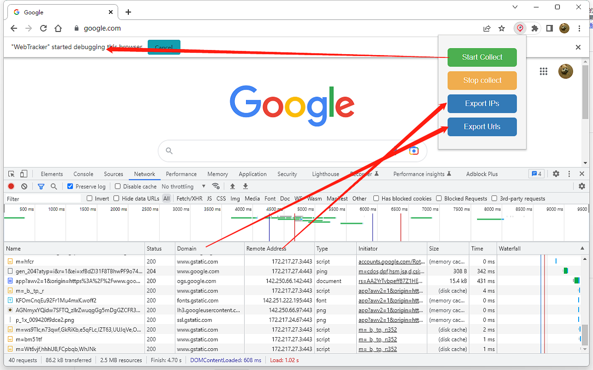
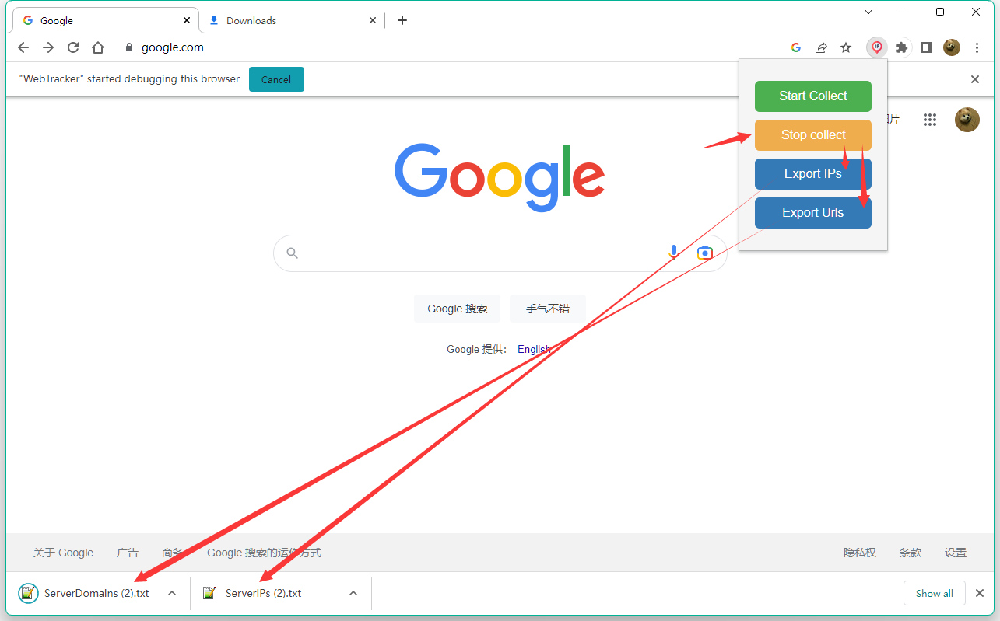

# WebNmap

WebTracker is a Chrome extension， Mainly used to collect data on domain names and remote IP addresses in developer tools. 
that allows users to track the IP addresses and domain names from network requests made by the pages they visit. It provides an easy way to start and stop tracking, and export the collected data as a .txt file.

## Features
* Start and stop IP and domain name tracking
* Export tracked IP addresses and domain names as a .txt file

## Installation
1. Clone this repository to your local machine.
2. Open the Extension Management page by navigating to chrome://extensions in your Chrome browser.
3. Enable Developer Mode by clicking the toggle switch next to Developer mode.
4. Click the LOAD UNPACKED button and select the directory containing the cloned repository.

## Usage
* Click the 'Start Collect' button to start tracking IPs and domain names.
* Click the 'Stop Collect' button to stop tracking.
* Click the 'Export IPs' button to download a .txt file of tracked IP addresses.
* Click the 'Export Urls' button to download a .txt file of tracked domain names.

## Contributing
Pull requests are welcome. For major changes, please open an issue first to discuss what you would like to change.

# WebNmap

WebNmap是一款Chrome扩展，主要用于收集开发者工具中的域名和远程IP地址列的数据。
允许用户收集他们所访问页面发出的网络请求中的IP地址和域名。它提供了一个简单的方式来开始和停止跟踪，并将收集到的数据导出为.txt文件。

## 特点
* 开始和停止IP和域名跟踪
* 将已跟踪的IP地址和域名导出为.txt文件

## 安装
1. 将此存储库克隆到您的本地计算机。
2. 通过在Chrome浏览器中导航到chrome://extensions打开“扩展管理”页面。
3. 单击旁边的切换按钮以启用开发人员模式。
4. 单击“加载未打包项”按钮并选择包含克隆存储库的目录。

## 使用方法
* 单击“Start Collect”按钮以开始跟踪IP地址和域名。
* 单击“Stop Collect”按钮以停止跟踪。
* 单击“Esport IPs”按钮下载已经被追踪过的IP地址.txt文件.
* 单击"Export Urls" 按钮下载已经被追踪过的域名txt文件.

## 贡献
欢迎提交拉取请求。对于重大更改，请先打开问题进行讨论。

